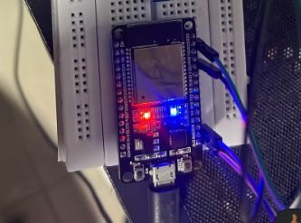

# Configuración de ESP32 en Arduino IDE para prueba

Esta guía te ayudará a configurar tu placa ESP32 en el Arduino IDE paso a paso.

## Prerrequisitos

- [Arduino IDE](https://www.arduino.cc/en/software) instalado
- Placa ESP32
- Cable USB de datos

---



## Configuración Paso a Paso

### 1. Verificar Reconocimiento del ESP32

1. Abre el Arduino IDE
2. Conecta tu ESP32 al PC con un cable USB de datos
3. Ve a: `Herramientas → Puerto`

**Comportamiento esperado:**
```
COM=!1 (ESP32 Dev Module)
```

**Si no aparece el puerto:** Necesitas instalar drivers según tu chip:

| Chip | Driver |
|------|--------|
| **CP2102** | [Descargar aquí](https://www.silabs.com/software-and-tools/usb-to-uart-bridge-vcp-drivers?tab=downloads) |
| **CH340** | [Descargar aquí](https://sparks.gogo.co.nz/ch340.html) |

### Instalar Soporte para ESP32

1. `Archivo → Preferencias`
2. En **"Gestor de URLs adicionales de tarjetas"**, pega:
   ```
   https://dl.espressif.com/dl/package_esp32_index.json
   ```
3. `Herramientas → Placa → Gestor de tarjetas`
4. Busca **"ESP32"** e instala el paquete de **Espressif Systems**

### Seleccionar Placa

`Herramientas → Placa → ESP32 Arduino → ESP32 Dev Module`

### Programa de Prueba: Blink

Crea un nuevo sketch y pega el siguiente código(o descarga el ESP32.ino e importalo en el IDE ):

```cpp
void setup() {
  pinMode(2, OUTPUT); 
}

void loop() {
  digitalWrite(2, HIGH);
  delay(500);
  digitalWrite(2, LOW);
  delay(500);
}
```

### Cargar el Programa

1. Haz clic en **Subir** (➡️)
2. Cuando aparezca **"Connecting..."**:
   - Presiona y mantén presionado el botón **BOOT** del ESP32
   - Suelta cuando empiece la carga

## Verificación

**Si todo funciona correctamente, verás en la consola:**
```
Hard resetting via RTS pin...
```

**Y el LED integrado en tu ESP32 parpadeará cada 500ms.** 

## Solución de Problemas

- **Error de carga:** Presiona el botón **BOOT** durante la conexión
- **Puerto no disponible:** Verifica los drivers y reinicia el IDE
- **Placa no reconocida:** Revisa la selección de placa en `Herramientas → Placa`


