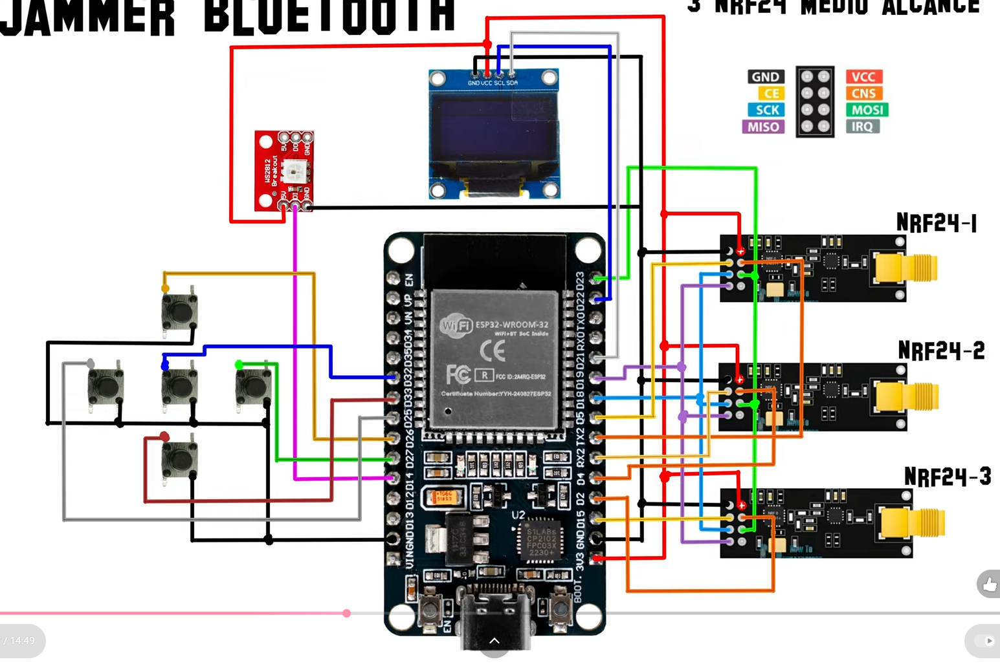

# 📡 nRFBox - Proyecto de Aprendizaje

> **PROYECTO EN CONSTRUCCIÓN**  
> **Fecha de inicio:** 2024  
> **Última actualización:** 2025-11-11  

---

##  Descripción

Proyecto educativo basado en el concepto de **nRFBox**, diseñado para el **aprendizaje en entornos controlados**.  
Versión mejorada que corrige errores comunes de implementación.

Inspirado en: *Video de referencia (por añadir)*

---

## Componentes Requeridos

###  Electrónicos Principales

| Componente | Imagen | Descripción |
|-------------|---------|-------------|
| **ESP32 WROOM 32U** |  | Microcontrolador principal con conectividad WiFi/Bluetooth |
| **ESP32 WROOM 32** |  | Alternativa para prototipos |
| **Antena WiFi** |  | Mejora la recepción de señal WiFi |
| **nRF24L01 Alcance L** |  | Comunicación RF de largo alcance |
| **nRF24L01 Alcance M** |  | Comunicación RF estándar |

---

### Pantallas e Interfaces

| Componente | Imagen | Descripción |
|-------------|---------|-------------|
| **Pantalla OLED 1.3"** |  | Pantalla grande para visualización |
| **Pantalla OLED 0.96"** |  | Pantalla compacta alternativa |
| **Botón Pulsador** |  | Interfaz de usuario táctil |
| **Módulo Control LED** |  | Control de indicadores luminosos |

---

### Conectividad y Alimentación

| Componente | Imagen | Descripción |
|-------------|---------|-------------|
| **Cables Prototipo** |  | Conexiones para prototipado |
| **Placas Prototipo** |  | Base para montaje de componentes |

---

## Estado Actual del Proyecto

| Etapa | Estado |
|--------|---------|
|  **Fase Actual** | Planificación |
|  **Lista de componentes** | Definida |
| **Diseño de esquemáticos** | En progreso |
| **Recolección de materiales** | En curso |
|  **Código firmware** | Pendiente |
|  **Ensamblaje** | Pendiente |

---

## 📅 Próximos Pasos

- [ ] Finalizar diseño de esquemáticos  
- [ ] Adquirir componentes faltantes  
- [ ] Desarrollar firmware básico  
- [ ] Ensamblaje inicial  
- [ ] Pruebas de funcionalidad  

---

## 📁 Recursos Descargables

**Drivers y Firmware** — [Descargar desde MEGA](https://mega.nz/folder/OQpDnLgY#gKpLGsnu_np7O00hVTvWxg)  
Incluye:

- Controladores para componentes  
- Firmware base  
- Librerías necesarias  
- Documentación técnica  

---

##  Esquemáticos

**Diagrama preliminar de conexiones**  
> *Sujeto a cambios durante el desarrollo.*

## Instalación y Configuración

>  Esta sección se completará cuando el firmware esté disponible.  
> Se incluirán pasos detallados para instalación, flasheo del firmware y configuración inicial.

---

##  Advertencia de Seguridad

> Este proyecto es **EXCLUSIVAMENTE para fines educativos** en ambientes controlados.  
> El uso inapropiado de estas tecnologías puede violar leyes locales.

